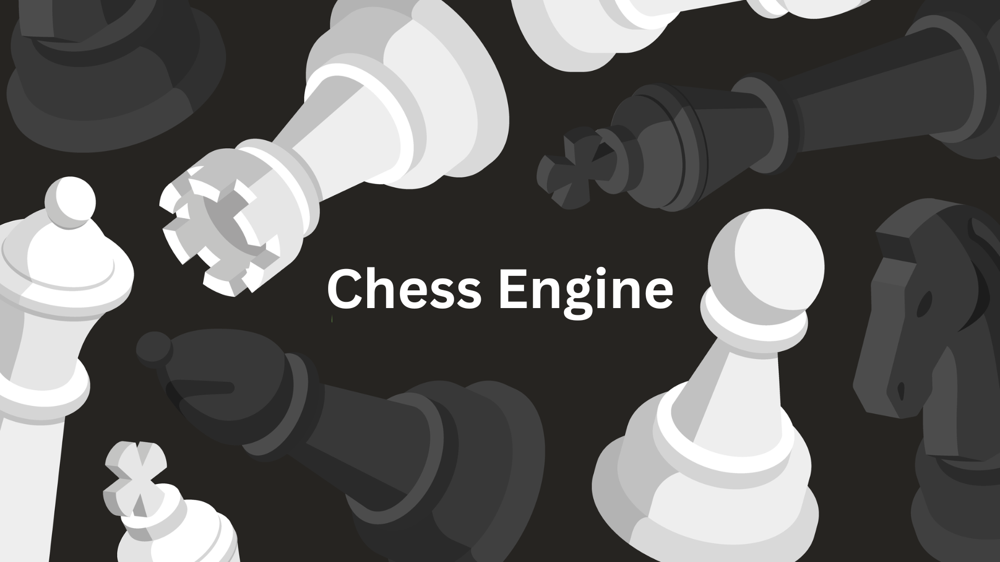
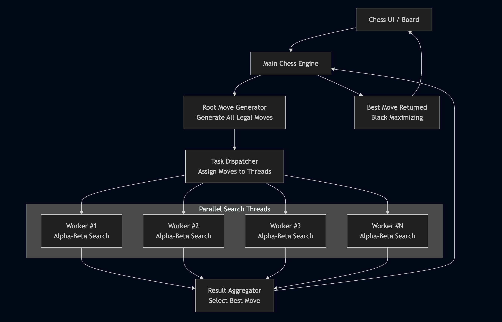
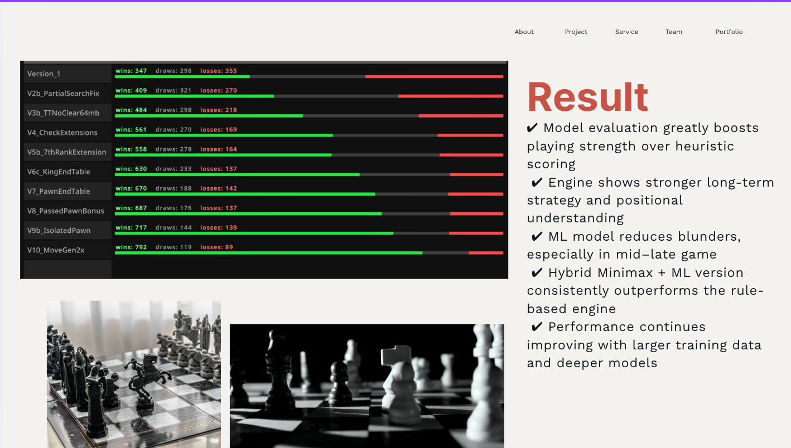
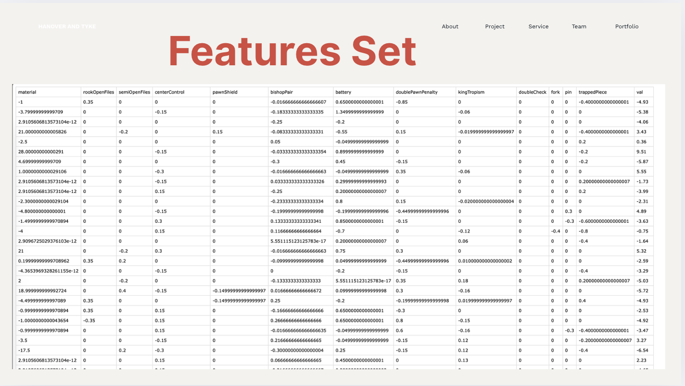
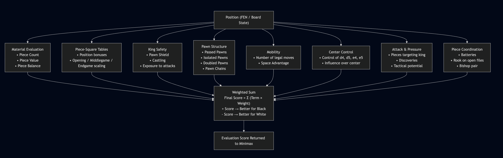
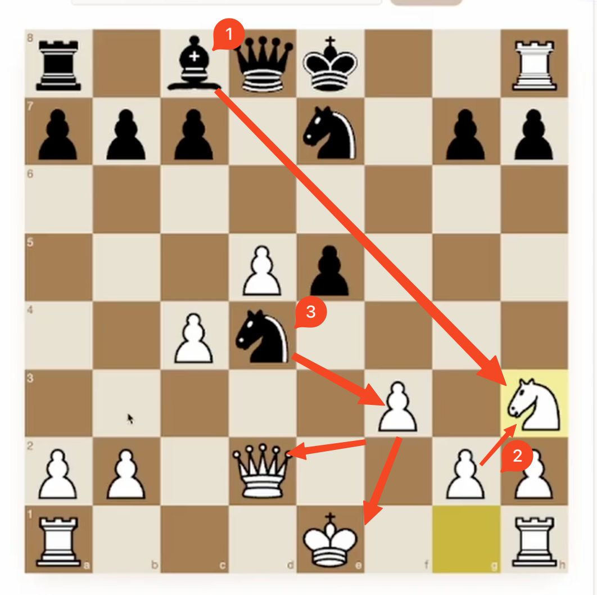

# ♟️ Chess Engine — Fast, Parallel, and Extensible

A modern TypeScript chess engine that demonstrates high-quality evaluation, efficient search (alpha-beta pruning), and parallel move exploration using worker threads. Ideal for learning, experimentation, and integration into web UIs or bots.

---

## 🔭 Highlights

- **Blazing Search:** Minimax with alpha-beta pruning and parallel search.
- **Tunable Evaluation:** Piece-square tables, material, king safety, and tuned heuristic weights (see `tuned_values.csv`).
- **Frontend-ready:** Integrates with a React/Vite frontend included in this repo.
- **Educational:** Clear code structure in `backend/src` for stepping through core algorithms.

---

## 🧭 Quick Start

1. Clone the repo

```bash
git clone https://github.com/priyanshupatel/chess-engine.git
cd chess-engine
```

2. Install backend dependencies and run dev server

```bash
cd backend
npm install
npm run dev
```

3. Start the frontend

```bash
cd ../frontend
npm install
npm run dev
```

Open the app in your browser (Vite usually runs at http://localhost:5173).

---

## 📁 Project Structure (high level)

- `backend/` — Engine logic, search, evaluation, and worker threads.
- `frontend/` — React + Vite UI to play and visualize engine decisions.
- `tuned_values.csv` — Tunable parameters used by the evaluation function.

---

## 🔧 Usage Examples

From the backend you can call endpoints to evaluate or search a position:

```
POST /api/evaluate    → returns evaluation score and features
POST /api/search      → returns best move with principal variation
```

See `backend/src` for implementation details: `evaluate.ts`, `minimax.ts`, and `searchBestMoveParallel.ts`.

---

## 🖼 Screenshots & Gallery

<div style="display:flex;gap:18px;flex-wrap:wrap">
    <figure style="width:100%;margin:0">
    	
    	<figcaption style="text-align:center;margin-top:8px;font-size:13px;color:#444">Architecture</figcaption>
    </figure>
    <figure style="width:100%;margin:0">
    	
    	<figcaption style="text-align:center;margin-top:8px;font-size:13px;color:#444">Alpha Beta Minmax</figcaption>
    </figure>
    <figure style="width:100%;margin:0">
    	
    	<figcaption style="text-align:center;margin-top:8px;font-size:13px;color:#444">Model Performance</figcaption>
    </figure>
    <figure style="width:100%;margin:0">
    	
    	<figcaption style="text-align:center;margin-top:8px;font-size:13px;color:#444">Feature Set</figcaption>
    </figure>
    <figure style="width:100%;margin:0">
    	
    	<figcaption style="text-align:center;margin-top:8px;font-size:13px;color:#444">Evaluation Function</figcaption>
    </figure>
</div>

---

## 🎬 Working

See the chess engine in action:

https://github.com/user-attachments/assets/edited.mov



---

## 📚 For Developers

- Run unit tests (if present) and linting from each package.
- Explore `backend/src/worker.ts` for parallel search orchestration.

---

## 🤝 Contributing

Contributions welcome — open issues or PRs. Follow the standard GitHub flow and include tests for new features.

---

## 📜 License

MIT — see LICENSE file.

---
